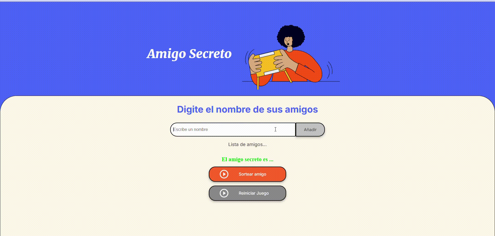

# Amigo Secreto 

Este es un proyecto web interactivo que permite agregar nombres de amigos y realizar un sorteo aleatorio para seleccionar al "Amigo Secreto".

## Características 
* Agregar nombres a la lista de participantes.

* Evitar la duplicación de nombres.

* Realizar un sorteo aleatorio entre los participantes.

* Reiniciar el juego para volver a ingresar nombres.

## Funcionamiento de la aplicación

## Instalación y Uso
1. Clonar el repositorio:
https://github.com/carlaclefig/Amigo-Secreto.git
2. Abrir el archivo index.html en un navegador web.
3. Agregar nombres en la caja de texto y hacer clic en "Añadir".
4. Hacer clic en "Sortear amigo" para elegir un amigo secreto al azar.
5. Para comenzar de nuevo, hacer clic en "Reiniciar Juego".